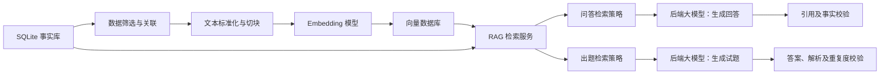

下面是一套基于现有 SQLite 结构的 RAG 流程参考方案。目标是向后端提供统一的向量检索能力，同时服务：

- AI 直接问答
- 考试题目生成

核心原则：SQLite 是唯一事实源，向量数据库是可重建的检索索引。问答和出题优先在调用策略上区分，不维护两套重复知识。

## 一、总体架构



建议组件：

| 组件 | 推荐职责 |
|---|---|
| SQLite | 保存来源、原档、正文、证据、引用和治理状态 |
| Embedding 模型 | 将证据文本编码为向量 |
| Qdrant、Milvus 或 pgvector | 保存向量及筛选元数据 |
| SQLite FTS5 | 精确关键词、法规名称和条款号检索 |
| RAG 服务 | 混合检索、过滤、重排和上下文组装 |
| 后端大模型 | 回答问题或生成试题 |

## 二、现有表的使用方式

现有数据库不需要整体向量化，应按职责使用：

| 现有表 | RAG 中的用途 |
|---|---|
| `sources` | 来源、发布机构、权威等级 |
| `raw_assets` | 原档追溯和文件校验 |
| `documents` | 文档标题、类型、版本、适用范围和完整正文 |
| `evidence_units` | 主要向量化对象 |
| `knowledge_entries` | 主题、风险类别和知识结论 |
| `knowledge_citations` | 知识条目与证据之间的引用关系 |
| `knowledge_fts` | 关键词混合检索 |
| `quarantine` | 排除隔离内容 |
| `collection_failures` | 排查数据处理失败 |
| `schema_metadata` | 模式版本和索引版本判断 |

第一版建议以 `evidence_units` 为向量化主体，因为它已经具备：

- 可控的文本长度
- 文档关联
- 原文定位
- 内容哈希
- 来源等级
- 审核状态

## 三、向量化数据准备

### 1. 数据准入过滤

从 `evidence_units` 关联 `documents` 和 `knowledge_entries`，过滤：

```text
invalidated = 0
version_status != 历史版本
document_id 未被隔离
text 不为空
content_hash 有效
```

当前内容属于“机器初审 / 待核验层”，后端必须知道这一状态，不能把它包装成已经人工确认的正式依据。

正式上线后建议默认增加：

```text
review_status = 人工审核通过
publication_layer = 正式依据层
```

### 2. 生成向量文本

不要只对裸正文编码。推荐拼接：

```text
标题：中华人民共和国安全生产法
类型：法律
主题：安全生产责任
位置：第五条
风险类别：综合安全管理
适用对象：生产经营单位、主要负责人
正文：生产经营单位的主要负责人是本单位安全生产第一责任人……
```

不应进入 Embedding 的字段：

- 文件路径
- SHA-256
- HTTP 状态码
- 采集时间
- 元数据 JSON 全文
- 超长 URL

这些内容保留在 metadata 中即可。

### 3. 切块策略

现有 `evidence_units` 已经是基础切块，第一版可直接使用。

建议控制：

| 文档类型 | 建议切块 |
|---|---|
| 法律、行政法规 | 一条或连续相关条款一个块 |
| 监管文件 | 一个完整要求或职责段落一个块 |
| 操作规程 | 一个操作步骤或风险控制单元一个块 |
| 事故调查报告 | 事故经过、原因、责任、整改分别切块 |
| 应急预案 | 响应级别、职责、处置步骤分别切块 |
| 企业制度 | 一个制度条款或岗位职责一个块 |

建议长度为 300～800 个中文字符。过短的相邻段落可合并，过长内容应继续拆分，并保留：

```text
parent_evidence_id
chunk_index
chunk_count
```

## 四、向量数据库结构

第一版建立一个集合即可：

```text
collection: safety_evidence_v1
```

每条向量记录建议包含：

```json
{
  "id": "ev_xxx:0",
  "vector": [],
  "text": "用于大模型的证据正文",
  "metadata": {
    "evidence_id": "ev_xxx",
    "document_id": "doc_xxx",
    "knowledge_id": "kb_xxx",
    "source_id": "source_xxx",
    "title": "中华人民共和国安全生产法",
    "document_type": "法律",
    "publisher": "全国人民代表大会常务委员会",
    "source_uri": "https://...",
    "locator": "第五条",
    "authority_level": "A",
    "version_status": "当前有效候选",
    "review_status": "机器初审",
    "publication_layer": "待核验层",
    "risk_categories": ["综合安全管理"],
    "applicable_roles": ["主要负责人"],
    "content_hash": "sha256...",
    "embedding_model": "模型名称",
    "embedding_version": "v1"
  }
}
```

必须保留 `evidence_id` 和 `document_id`，后端才能回查 SQLite、补充引用和验证版本。

## 五、索引构建流程

```text
1. 读取 schema_metadata
2. 查询符合准入规则的 evidence_units
3. 关联 documents、knowledge_entries、knowledge_citations
4. 清理正文和异常空白
5. 按文档类型检查或二次切块
6. 生成 embedding_text
7. 批量调用 Embedding 模型
8. 写入向量数据库
9. 保存 content_hash 和 embedding_version
10. 核对 SQLite 记录数与向量记录数
11. 执行固定问题检索验收
12. 发布向量索引版本
```

增量更新通过 `content_hash` 判断：

- 哈希不存在：新增向量
- 哈希未变化：跳过
- 哈希变化：重新生成
- SQLite 记录失效：删除或标记向量失效
- Embedding 模型变化：建立新集合版本

不建议直接覆盖旧索引。推荐：

```text
safety_evidence_v1
safety_evidence_v2
```

验证通过后，由后端配置切换到新版本。

## 六、统一 RAG 检索服务

后端不应直接让大模型任意操作向量库，而应提供固定接口。

例如：

```text
POST /rag/retrieve
```

请求：

```json
{
  "query": "施工单位主要负责人的安全责任是什么？",
  "profile": "answer",
  "filters": {
    "document_type": ["法律", "行政法规"],
    "publication_layer": ["待核验层"]
  },
  "top_k": 8
}
```

响应：

```json
{
  "results": [
    {
      "evidence_id": "ev_xxx",
      "document_id": "doc_xxx",
      "title": "中华人民共和国安全生产法",
      "locator": "第五条",
      "text": "……",
      "source_uri": "https://...",
      "score": 0.91
    }
  ],
  "index_version": "safety_evidence_v1"
}
```

## 七、AI 问答流程

```text
用户问题
→ 问题分类和过滤条件提取
→ 向量检索
→ SQLite FTS5 关键词检索
→ 合并与去重
→ 权威性重排
→ 补充相邻证据
→ 组装受控上下文
→ 大模型生成回答
→ 引用完整性检查
→ 返回答案和来源
```

建议使用混合检索：

```text
综合分数 =
    50% 向量相似度
  + 25% FTS5 关键词匹配
  + 15% 权威等级
  + 10% 版本与审核状态
```

问答检索策略：

- Top K 通常为 5～8
- 法律和行政法规优先
- 当前有效版本优先
- 同一证据重复结果合并
- 必要时补充前后条款
- 无充分依据时明确回答“知识库未收录或依据不足”
- 每个结论必须带 `title + locator + source_uri`

模型上下文建议：

```text
只能依据提供的证据回答。
不得补充证据之外的法律义务、处罚金额或事故原因。
证据冲突时，优先采用当前有效且权威等级更高的材料。
回答末尾列出引用文档及原文位置。
```

## 八、考试出题流程

出题不能直接复用问答的 Top K 逻辑。否则题目会集中在少数高相关条款。

```text
出题要求
→ 解析题型、数量、难度和考试范围
→ 按文档类型、风险类别、角色分层抽样
→ 排除近期已经使用的知识点
→ 检索知识点证据和相邻条款
→ 大模型生成题目
→ 答案可证性检查
→ 选项合理性检查
→ 题目语义去重
→ 输出题目、答案、解析和引用
```

出题检索策略：

| 参数 | 建议 |
|---|---|
| 检索方式 | 分类过滤后随机或加权采样 |
| 单题证据 | 1～3 个相关证据单元 |
| 权威范围 | 根据考试范围限定 |
| 难度 | 由证据组合复杂度决定 |
| 去重 | 按知识点 ID、题干向量和答案去重 |
| 输出 | 题目、选项、答案、解析、引用 |

建议的题目结构：

```json
{
  "question_id": "q_xxx",
  "question_type": "single_choice",
  "difficulty": "medium",
  "knowledge_ids": ["kb_xxx"],
  "question": "生产经营单位安全生产第一责任人是谁？",
  "options": {
    "A": "主要负责人",
    "B": "安全管理人员",
    "C": "工会负责人",
    "D": "项目监理人员"
  },
  "answer": "A",
  "explanation": "依据《安全生产法》第五条……",
  "evidence_ids": ["ev_xxx"],
  "source_uri": "https://...",
  "review_status": "待审核"
}
```

生成后必须检查：

1. 正确答案能由证据唯一推出。
2. 题干没有泄露答案。
3. 干扰项不存在多个正确答案。
4. 处罚金额、日期、职责主体与原文一致。
5. 解析引用的 `evidence_id` 真实存在。
6. 题目默认进入待审核状态，不能直接作为正式考试题。

## 九、是否建立两个向量集合

推荐分两个阶段。

第一阶段：

```text
safety_evidence_v1
```

问答和出题共用一个向量集合，通过 `profile=answer` 和 `profile=exam` 使用不同检索策略。这最容易维护，也能保证两种用途引用同一份事实。

第二阶段只有在出题质量需要时增加：

```text
safety_learning_units_v1
```

教学单元可以由同一主题下的相邻证据组合而成，用于生成综合题和案例题。但它仍是 SQLite 的派生索引，不能取代 `evidence_units`。

因此，推荐结论是：

- 数据事实差异放在 SQLite 元数据和审核状态中。
- 问答与出题的主要差异放在调用时。
- 切块粒度确实不同时，才增加第二个向量集合。
- 两种用途最终都必须回到 `evidence_id` 进行引用和事实校验。

## 十、验收指标

向量化完成后至少验证：

| 指标 | 建议目标 |
|---|---:|
| 可向量化证据覆盖率 | 100% |
| 向量记录与 `content_hash` 对应率 | 100% |
| 引用可回查率 | 100% |
| 固定问题 Top 5 命中率 | ≥ 90% |
| 法规名称和条款号命中率 | 100% |
| 无依据回答拒答率 | 100% |
| 生成题目答案可证率 | 100% |
| 重复题率 | ≤ 5% |
| 失效内容默认检索率 | 0% |
| 向量索引重建可重复性 | 100% |

最终建议采用“一个 SQLite 事实库、一个基础证据向量集合、两个调用配置”的第一版架构。这样后端接口统一，问答和出题互不混淆，后续又能平滑增加教学单元集合。