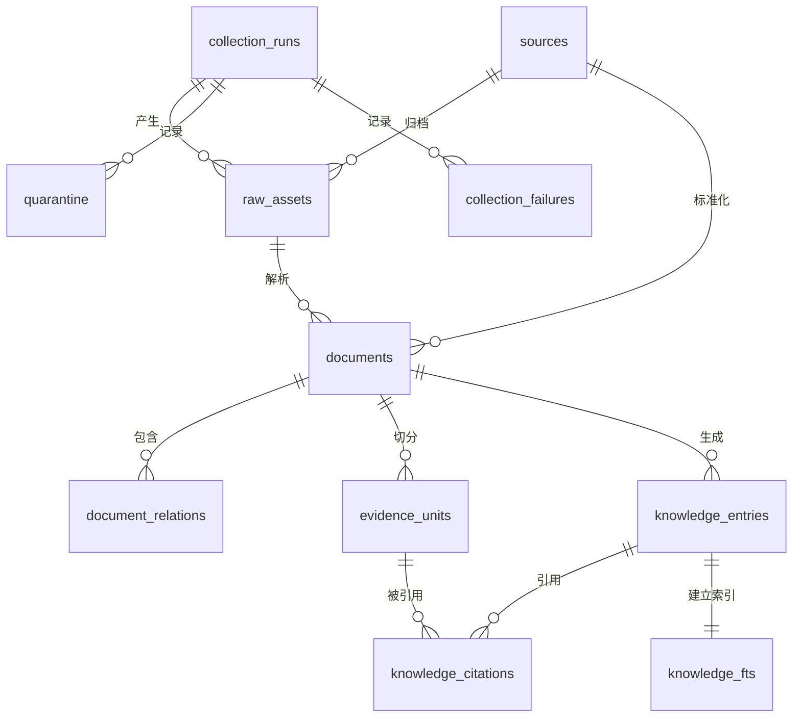

# 交通建设与运营安全知识库数据库结构规范

## 1. 基本信息

| 项目 | 规定 |
|---|---|
| 数据库 | SQLite 3 |
| 文件 | `data/transport_safety_kb.sqlite3` |
| 模式版本 | `2` |
| 字符编码 | UTF-8 |
| 主键策略 | 业务实体使用稳定文本 ID；失败记录使用自增整数 |
| 时间格式 | ISO 8601 字符串，例如 `2026-08-11T13:25:22+00:00` |
| 布尔值 | `INTEGER`，仅允许 `0` 或 `1` |
| 数组和对象 | UTF-8 JSON 文本，字段名以 `_json` 结尾 |
| 正文检索 | SQLite FTS5；不可用时回退普通表 |
| 默认访问 | 查询工具以 `mode=ro` 和 `PRAGMA query_only=ON` 只读访问 |

当前数据库快照时间为 2026-08-11。数据量会在后续采集闭环中变化，表结构以本规范和
`schema_metadata.schema_version` 为准。

## 2. 逻辑分层

| 层级 | 表 | 用途 |
|---|---|---|
| 模式层 | `schema_metadata` | 保存模式版本、FTS 能力和统一审核状态 |
| 运行层 | `collection_runs` | 保存每轮采集任务及汇总 |
| 来源层 | `sources` | 保存来源登记、发布主体和权威属性 |
| 原档层 | `raw_assets` | 保存每份本地原档、哈希和采集元数据 |
| 文档层 | `documents`、`document_relations` | 保存标准化文档和文档间关系 |
| 证据层 | `evidence_units` | 保存可精确引用的条款或段落 |
| 知识层 | `knowledge_entries`、`knowledge_citations` | 保存检索条目及证据引用 |
| 检索层 | `knowledge_fts` | 保存主题和结论的全文检索索引 |
| 治理层 | `quarantine`、`collection_failures` | 保存隔离记录和采集失败记录 |

## 3. 实体关系



主追溯链路：

```text
collection_runs -> raw_assets -> sources -> documents
                                      |          |
                                      |          +-> evidence_units
                                      |          +-> knowledge_entries
                                      |                    |
                                      +--------------------+-> knowledge_citations
```

结构化知识必须能够通过 `knowledge_citations.evidence_id` 回到证据单元，再通过
`evidence_units.document_id` 和 `documents.raw_asset_id` 回到本地原档。

## 4. 表结构

### 4.1 `schema_metadata`

保存数据库自身的模式和运行能力。

| 字段 | 类型 | 约束 | 说明 |
|---|---|---|---|
| `key` | TEXT | PK | 配置键 |
| `value` | TEXT | NOT NULL | 配置值 |

固定键包括 `schema_version`、`fts5_available`、`review_status`。

### 4.2 `collection_runs`

每执行一次完整采集闭环产生一条记录。

| 字段 | 类型 | 约束 | 说明 |
|---|---|---|---|
| `task_id` | TEXT | PK | 本轮采集任务 ID |
| `completed_at` | TEXT | NOT NULL | 完成时间，ISO 8601 |
| `summary_json` | TEXT | NOT NULL | 本轮来源、文档、证据、失败等汇总 JSON |

### 4.3 `sources`

来源登记表。一条记录表示一个被准入或待处理的来源配置。

| 字段 | 类型 | 约束 | 说明 |
|---|---|---|---|
| `source_id` | TEXT | PK | 稳定来源 ID |
| `plugin` | TEXT | NOT NULL | 采集插件名称 |
| `source_uri` | TEXT | NOT NULL | 原始来源 URI |
| `title` | TEXT | NOT NULL | 来源标题 |
| `publisher` | TEXT | NOT NULL | 发布机构 |
| `document_type` | TEXT | NOT NULL | 文档类型 |
| `authority_level` | TEXT | NOT NULL | 权威等级，如 `A` |
| `version_status` | TEXT | NOT NULL | 当前有效候选、历史版本或不适用 |
| `extra_json` | TEXT | NOT NULL | 插件扩展元数据 JSON；基础字段不重复保存 |

### 4.4 `raw_assets`

原档归档表。文件内容不写入 SQLite，只保存定位、哈希和采集事实。

| 字段 | 类型 | 约束 | 说明 |
|---|---|---|---|
| `raw_asset_id` | TEXT | PK | 原档稳定 ID |
| `task_id` | TEXT | FK, NOT NULL | 关联 `collection_runs.task_id` |
| `source_id` | TEXT | FK, NOT NULL | 关联 `sources.source_id` |
| `requested_uri` | TEXT | NOT NULL | 请求前 URI |
| `final_uri` | TEXT | NOT NULL | 重定向后的最终 URI |
| `retrieved_at` | TEXT | NOT NULL | 获取时间 |
| `status_code` | INTEGER | NOT NULL | HTTP 或等效状态码 |
| `media_type` | TEXT | NOT NULL | MIME 类型 |
| `raw_sha256` | TEXT | NOT NULL | 原始字节 SHA-256 |
| `raw_path` | TEXT | NOT NULL | 本地原档相对路径 |
| `archive_metadata_path` | TEXT | NOT NULL | 原档元数据 JSON 相对路径 |
| `transport` | TEXT | NOT NULL | 传输方式，如 `curl`、`local-file` |
| `transport_note` | TEXT | NOT NULL | 传输说明 |

### 4.5 `documents`

标准文档主表。一份附件包含多份正式文档时，可以由一份原档生成多条文档记录。

| 字段 | 类型 | 约束 | 说明 |
|---|---|---|---|
| `document_id` | TEXT | PK | 标准文档稳定 ID |
| `source_id` | TEXT | FK, NOT NULL | 关联 `sources.source_id` |
| `raw_asset_id` | TEXT | FK, NOT NULL | 关联 `raw_assets.raw_asset_id` |
| `title` | TEXT | NOT NULL | 精确文档标题 |
| `document_type` | TEXT | NOT NULL | 法律、行政法规、监管文件、事故调查材料等 |
| `published_at` | TEXT | NOT NULL | 发布日期；未知时为空字符串 |
| `effective_from` | TEXT | NOT NULL | 生效日期；不适用或未知时为空字符串 |
| `effective_to` | TEXT | NOT NULL | 失效日期；当前有效或未知时为空字符串 |
| `version_status` | TEXT | NOT NULL | 版本状态 |
| `jurisdiction` | TEXT | NOT NULL | 国家或行政区域 |
| `applicable_roles_json` | TEXT | NOT NULL | 适用角色数组 JSON |
| `applicable_activities_json` | TEXT | NOT NULL | 适用活动数组 JSON |
| `license_status` | TEXT | NOT NULL | 公开和使用许可状态 |
| `content_hash` | TEXT | NOT NULL | 标准正文 SHA-256 |
| `retrieved_at` | TEXT | NOT NULL | 采集时间 |
| `section_locator` | TEXT | NOT NULL | 原文定位方式，如 PDF 页码与条款 |
| `review_status` | TEXT | NOT NULL | 审核状态，当前为机器初审 |
| `publication_layer` | TEXT | NOT NULL | 发布层，当前为待核验层 |
| `text` | TEXT | NOT NULL | 抽取后的完整正文 |
| `fetch_status` | TEXT | NOT NULL | 获取状态或获取方式 |
| `governance_notes_json` | TEXT | NOT NULL | 治理说明数组 JSON |

### 4.6 `document_relations`

保存补充、替代、拆分来源等文档关系。

| 字段 | 类型 | 约束 | 说明 |
|---|---|---|---|
| `relation_id` | TEXT | PK | 关系稳定 ID |
| `document_id` | TEXT | FK, NOT NULL, DELETE CASCADE | 关联 `documents.document_id` |
| `relation_text` | TEXT | NOT NULL | 关系说明 |

### 4.7 `evidence_units`

可引用证据单元。法规按条款切分，其他文档按可定位段落切分。

| 字段 | 类型 | 约束 | 说明 |
|---|---|---|---|
| `evidence_id` | TEXT | PK | 证据稳定 ID |
| `document_id` | TEXT | FK, NOT NULL, DELETE CASCADE | 关联 `documents.document_id` |
| `locator` | TEXT | NOT NULL | 页码、条款或段落定位 |
| `text` | TEXT | NOT NULL | 证据原文 |
| `content_hash` | TEXT | NOT NULL | 证据正文 SHA-256 |

### 4.8 `knowledge_entries`

面向检索和问答的知识条目。每条知识必须指向其来源文档。

| 字段 | 类型 | 约束 | 说明 |
|---|---|---|---|
| `knowledge_id` | TEXT | PK | 知识条目稳定 ID |
| `document_id` | TEXT | FK, NOT NULL, DELETE CASCADE | 关联 `documents.document_id` |
| `topic` | TEXT | NOT NULL | 检索主题 |
| `risk_categories_json` | TEXT | NOT NULL | 风险类别数组 JSON |
| `conclusion` | TEXT | NOT NULL | 可检索的知识正文或结论 |
| `review_status` | TEXT | NOT NULL | 审核状态 |
| `publication_layer` | TEXT | NOT NULL | 待核验层或正式依据层 |
| `invalidated` | INTEGER | NOT NULL, CHECK 0/1 | `1` 表示失效，不进入默认检索 |

### 4.9 `knowledge_citations`

知识条目和证据单元的多对多连接表，同时固化引用顺序和定位。

| 字段 | 类型 | 约束 | 说明 |
|---|---|---|---|
| `knowledge_id` | TEXT | PK(1), FK, NOT NULL, DELETE CASCADE | 关联 `knowledge_entries.knowledge_id` |
| `citation_order` | INTEGER | PK(2), NOT NULL | 同一知识条目内的引用顺序，从 1 开始 |
| `evidence_id` | TEXT | FK, NOT NULL | 关联 `evidence_units.evidence_id` |

联合主键为 `(knowledge_id, citation_order)`。

### 4.10 `knowledge_fts`

FTS5 虚拟表，用于全文检索知识主题和结论。

| 字段 | 索引方式 | 说明 |
|---|---|---|
| `knowledge_id` | UNINDEXED | 对应知识条目 ID |
| `topic` | FULL TEXT | 主题全文索引 |
| `conclusion` | FULL TEXT | 结论全文索引 |

该表由知识库重建流程同步生成，不作为知识事实的唯一存储位置。

### 4.11 `quarantine`

保存因来源治理、字段缺失或版本冲突被隔离的记录。

| 字段 | 类型 | 约束 | 说明 |
|---|---|---|---|
| `quarantine_id` | TEXT | PK | 隔离记录 ID |
| `task_id` | TEXT | FK, NOT NULL | 关联 `collection_runs.task_id` |
| `source_id` | TEXT | 可空 | 涉及的来源 ID |
| `record_json` | TEXT | NOT NULL | 隔离对象和原因 JSON |

### 4.12 `collection_failures`

保存采集、解析、治理或持久化阶段的失败事实。

| 字段 | 类型 | 约束 | 说明 |
|---|---|---|---|
| `failure_id` | INTEGER | PK, AUTOINCREMENT | 失败记录编号 |
| `task_id` | TEXT | FK, NOT NULL | 关联 `collection_runs.task_id` |
| `stage` | TEXT | NOT NULL | 失败阶段 |
| `source_id` | TEXT | 可空 | 涉及的来源 ID |
| `record_json` | TEXT | NOT NULL | 错误、重试和上下文 JSON |

## 5. 外键与删除规则

| 子表字段 | 父表字段 | 删除父记录时 |
|---|---|---|
| `raw_assets.task_id` | `collection_runs.task_id` | NO ACTION |
| `raw_assets.source_id` | `sources.source_id` | NO ACTION |
| `documents.source_id` | `sources.source_id` | NO ACTION |
| `document_relations.document_id` | `documents.document_id` | CASCADE |
| `evidence_units.document_id` | `documents.document_id` | CASCADE |
| `knowledge_entries.document_id` | `documents.document_id` | CASCADE |
| `knowledge_citations.knowledge_id` | `knowledge_entries.knowledge_id` | CASCADE |
| `knowledge_citations.evidence_id` | `evidence_units.evidence_id` | NO ACTION |
| `quarantine.task_id` | `collection_runs.task_id` | NO ACTION |
| `collection_failures.task_id` | `collection_runs.task_id` | NO ACTION |

数据库重建和验收必须启用 `PRAGMA foreign_keys=ON`，并通过
`PRAGMA integrity_check` 与 `PRAGMA foreign_key_check`。

## 6. 索引

| 索引 | 字段 | 目的 |
|---|---|---|
| `idx_sources_document_type` | `sources.document_type` | 按来源文档类型统计和筛选 |
| `idx_sources_authority` | `sources.authority_level` | 按来源权威等级筛选 |
| `idx_raw_assets_source_id` | `raw_assets.source_id` | 来源原档反向关联 |
| `idx_raw_assets_sha256` | `raw_assets.raw_sha256` | 原档去重 |
| `idx_documents_source_id` | `documents.source_id` | 来源文档反向关联 |
| `idx_documents_document_type` | `documents.document_type` | 按标准文档类型筛选 |
| `idx_documents_version_status` | `documents.version_status` | 排除历史或无效版本 |
| `idx_documents_review_status` | `documents.review_status` | 人工审核工作流筛选 |
| `idx_evidence_document_id` | `evidence_units.document_id` | 文档到证据单元回溯 |
| `idx_evidence_content_hash` | `evidence_units.content_hash` | 证据去重 |
| `idx_knowledge_document_id` | `knowledge_entries.document_id` | 文档到知识条目回溯 |
| `idx_knowledge_review_status` | `knowledge_entries.review_status` | 发布层审核筛选 |
| `idx_knowledge_citations_evidence_id` | `knowledge_citations.evidence_id` | 证据到知识反向回溯 |

## 7. 当前数据快照

| 表 | 记录数 |
|---|---:|
| `collection_runs` | 1 |
| `sources` | 93 |
| `raw_assets` | 93 |
| `documents` | 121 |
| `document_relations` | 8 |
| `evidence_units` | 1,736 |
| `knowledge_entries` | 1,736 |
| `knowledge_citations` | 1,736 |
| `knowledge_fts` | 1,736 |
| `quarantine` | 0 |
| `collection_failures` | 0 |
| `schema_metadata` | 3 |

## 8. 结构约束

1. 每个 `documents.source_id` 必须存在于 `sources`，且 `documents.raw_asset_id` 必须存在于 `raw_assets`。
2. 每个 `raw_assets` 必须同时关联本轮任务和来源，并指向真实存在的本地原档及元数据文件。
3. 每个 `evidence_units` 必须保留官方 URI、标题、精确定位和正文哈希。
4. 每个可发布 `knowledge_entries` 至少应有一条 `knowledge_citations`。
5. 引用中的 `evidence_id` 必须存在，且引用 URI 和定位作为生成时快照保留。
6. `invalidated=1`、历史版本或未通过审核的内容不得进入正式依据层默认检索。
7. JSON 字段必须是合法 JSON；数组字段必须存储 JSON 数组，不能存储逗号拼接字符串。
8. 原档去重依据 `raw_sha256`，正文去重依据 `content_hash`，但不能仅因哈希相同删除来源追溯关系。
9. SQLite 文件采用离线临时库完整重建，验证通过后再原子替换正式库。
10. 查询工具默认只读，任何人工审核状态变更应通过单独的受控审核流程实施。

## 9. 常用结构查询

```powershell
python query_database.py
python query_database.py tables
python query_database.py schema --table documents
python query_database.py rows --table documents --limit 10
python query_database.py search --keyword "隧道事故"
```

直接执行 `python query_database.py` 可进入 Rich 中文交互界面。
